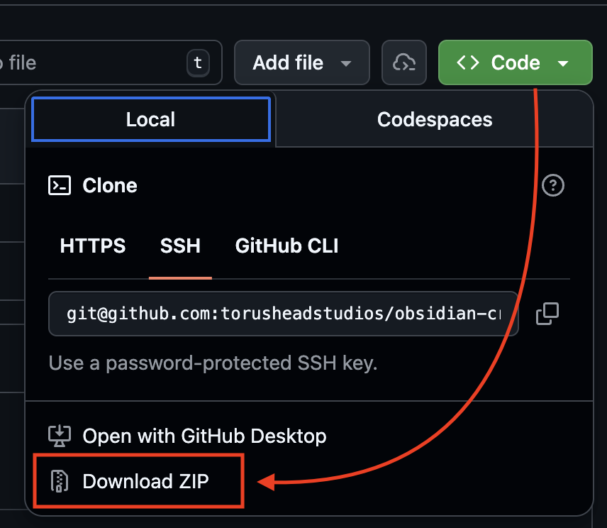
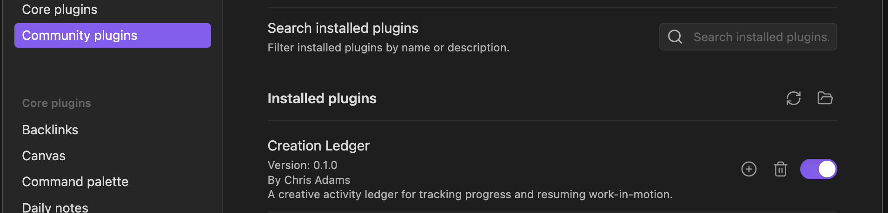

# Creation Ledger

Creation Ledger is a simple way to capture what you're working on, track progress, and quickly remember where to pick things up again — using plain Obsidian notes.

## Who It's For

Creation Ledger is designed for people who:
- Work on multiple ideas or projects
- Frequently stop and restart work
- Want lightweight structure without turning notes into a rigid task system

## Installation

### Method A: Install from Obsidian Community Plugins

1. Open Obsidian Settings
2. Go to Community Plugins
3. Search for "Creation Ledger"
4. Install and enable

### Method B: Install from GitHub ZIP (Manual Install)

1. Download the plugin ZIP from GitHub:
   https://github.com/torusheadstudios/obsidian-creation-ledger

*Download the .ZIP*

2. Unzip the folder.

3. Rename the folder to:
   `creation-ledger`

4. Move the folder into:
   `<your-vault>/.obsidian/plugins/`

5. Restart Obsidian

6. Enable "Creation Ledger" in Community Plugins.

*Enable Creation Ledger*

## Quick Start

1. **Open the Command Palette** (Cmd/Ctrl + P) and run "Creation Ledger: Capture Activity"

2. **Fill in the form** with a title and status (project and tags are optional)

3. **Click Create** — your note is saved automatically in the `CreationLedger/` folder

That's it! Your activities are now being tracked as regular Markdown notes in your vault.

**Optional:** Install [Dataview](https://obsidian.md/plugins?search=dataview) to use dashboards and the Kanban board. Activity capture works without it.

## Documentation

- [Index](docs/index.md) — Detailed installation and setup
- [Getting Started](docs/getting-started.md) — Detailed installation and setup
- [Dashboards](docs/dashboards.md) — Overview views of your work
- [Kanban Board](docs/kanban.md) — Visual status board
- [Registries](docs/registries.md) — Customize dropdown options
- [Troubleshooting](docs/troubleshooting.md) — Common issues and solutions

## Important to Know

- All files are normal Markdown
- You can move, rename, or delete anything
- You can stop using the plugin at any time
- Your notes remain usable forever
