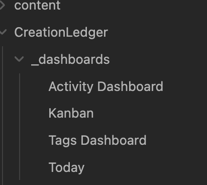

# Dashboards

Dashboards provide overviews of your work, letting you see recent activities, filter by project or status, and change statuses without opening individual notes.

Creation Ledger ships with built in dashboards, you can add more.

## About Dashboards

Dashboards are special notes that use Dataview queries to display your Creation Ledger activities in organized views.

## How It Works

Creation Ledger creates dashboard notes for reviewing your work. You can open them using commands:

- Creation Ledger: Open Today Dashboard
- Creation Ledger: Open Activity Dashboard
- Creation Ledger: Open Kanban Board

or click on a note in your vault:

Dashboards use Dataview queries that let you:
- See recent work at a glance
- Filter by project or status
- Change a note's status without opening it

If Dataview isn't installed, dashboards simply won't render — nothing breaks. Activity capture works independently of Dataview.

## When to Use It

Use dashboards when you want to:
- Review what you've worked on recently
- Get an overview of multiple activities
- Quickly update statuses across multiple items
- Filter and organize your work

## Related

- [Getting Started](getting-started.md)
- [Kanban Board](kanban.md)
- [Troubleshooting](troubleshooting.md)

