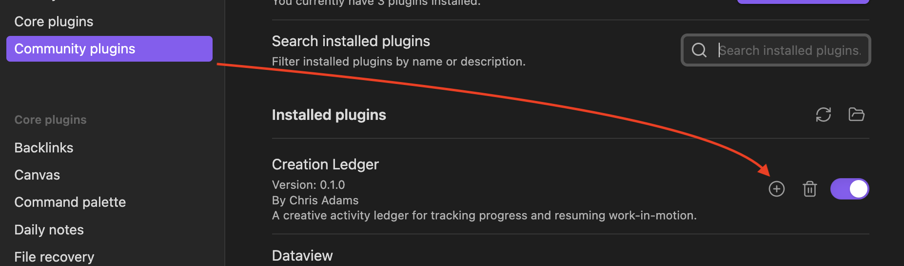
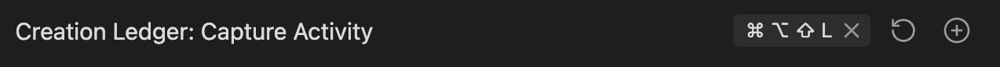
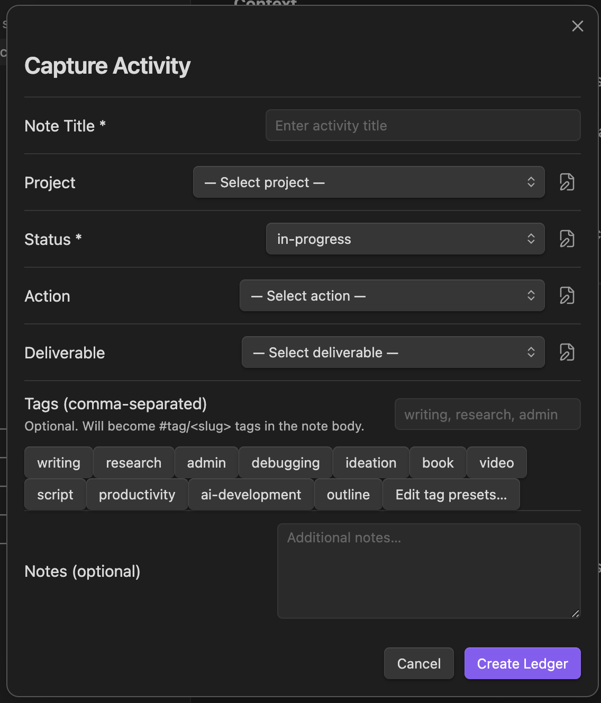

# Getting Started

Install Creation Ledger and capture your first activity.


## How It Works


### Install Dataview for Dashboards

Creation Ledger dashboards use the Dataview community plugin.

Activity capture works without Dataview, but dashboards and the Kanban board require it.

To install Dataview:

1. Settings → Community plugins
2. Search for Dataview
3. Install and enable

Then enable JavaScript queries:

1. Settings → Dataview
2. Turn on JavaScript Queries
3. Restart Obsidian

### Your First Capture

1. Open the Command Palette:
   - Cmd/Ctrl + P
   - Run "Creation Ledger: Capture Activity"

You can also add a keyboard shortcut in settings:






2. You'll see a simple form where you can enter:
   - A short title
   - What project it relates to (optional)
   - Its current status (required)
   - Optional tags and notes

3. Click `Create Ledger`, and you're done.



A new note is created automatically in your vault.

```
your activity notes are organized by date:

CreationLedger/
  2025/
    12/
      28/
        2025-12-28 20_21_26 Example note.md
```

Click on a dashboard to see your CreationLedger notes on a dashboard:


## Related

- [Dashboards](dashboards.md)
- [Troubleshooting](troubleshooting.md)

