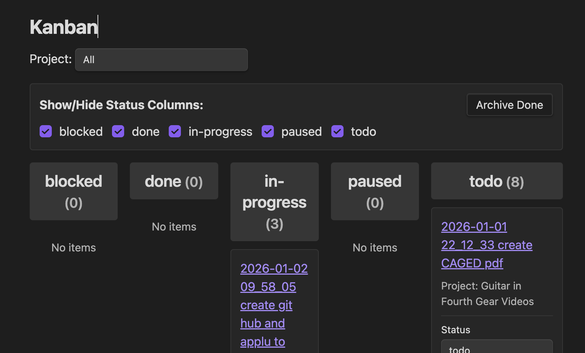
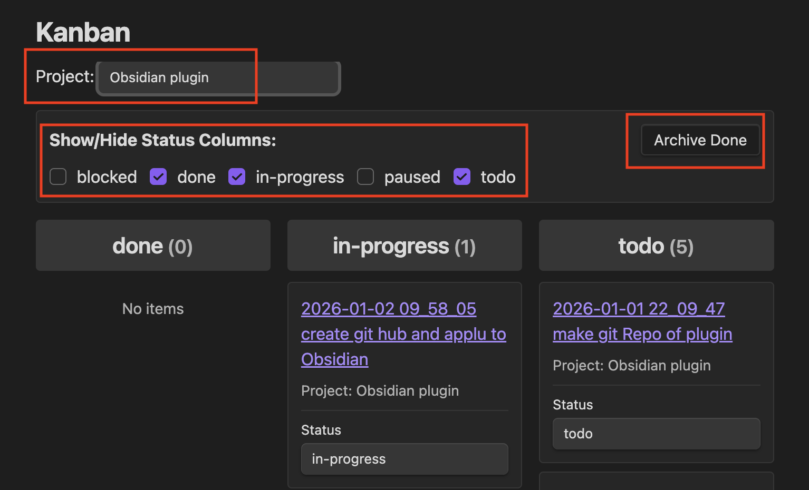
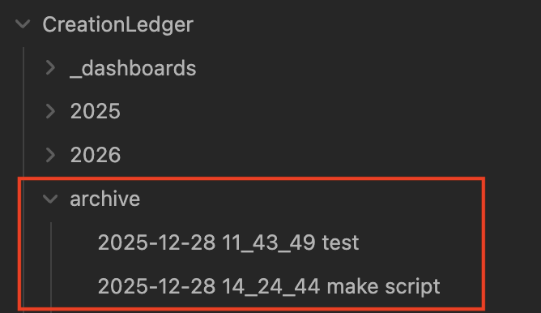

# Kanban Board

The Kanban board displays your Creation Ledger activities grouped by status in a column-based view. The Kanban board requires Dataview to be installed and JavaScript queries enabled.

## How It Works

Open the Kanban board using the command:
- Creation Ledger: Open Kanban Board

or click on `Kanban` in your vault:

The board displays your activities in columns, one for each status (todo, in-progress, blocked, done, etc.). You can change a note's status directly from the board without opening the note.

There will be a slight delay as the query updates the view: Drag and drop is not supported.

You can filter by project, show/hide columns and also `Archive Done`. Archiving notes moves them to a folder that is ignored by the view.  You can then delete them or save them for reference. 

## Related

- [Dashboards](dashboards.md)
- [Getting Started](getting-started.md)
- [Troubleshooting](troubleshooting.md)

