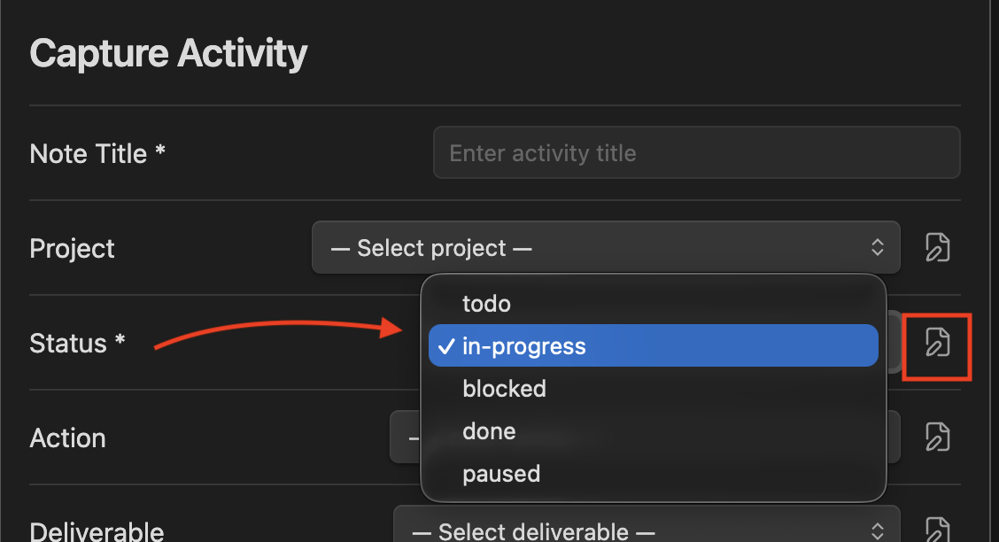
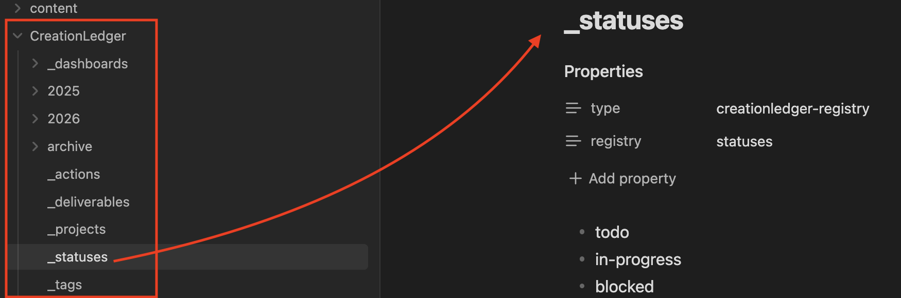

# Data Registries

Data registries are simple Markdown files that populate the dropdowns in the capture modal and control what options are available for projects, statuses, tags, actions, and deliverables.

## What They Do

Registries store the lists of values that appear in the capture modal. They're just Markdown files that you can edit directly.

## How It Works

Registry files live directly in the CreationLedger/ folder:
- `_projects.md`
- `_statuses.md`
- `_actions.md`
- `_deliverables.md`
- `_tags.md`

Each file is just a Markdown list with frontmatter, for example:

`_statuses.md`

```markdown
---
type: creationledger-registry
registry: statuses
---
- todo
- in-progress
- blocked
- done
- paused
```

You can:
- Add new items
- Rename existing ones
- Reorder them

Changes take effect immediately — no restart required.

## As a Dropdown in the Capture Activity Modal 



## Status Registry File 



## Edit registries when you want to:

- Customize the options available in the capture modal
- Add new statuses or projects
- Organize tags or other categories
- Remove options you don't use

## Related

- [Capture Modal](capture.md)
- [Getting Started](getting-started.md)
- [index](index.md)

