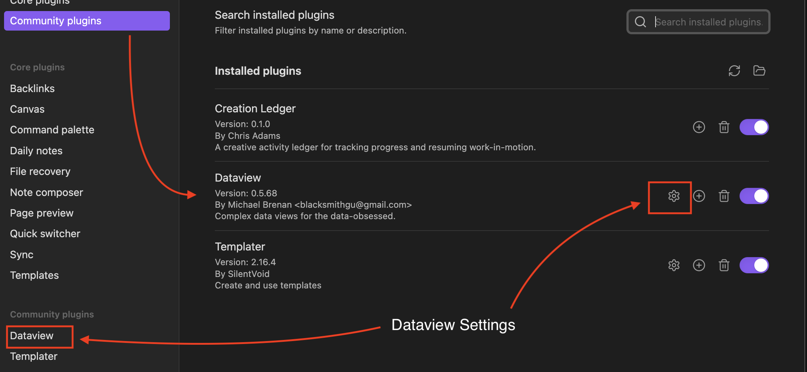
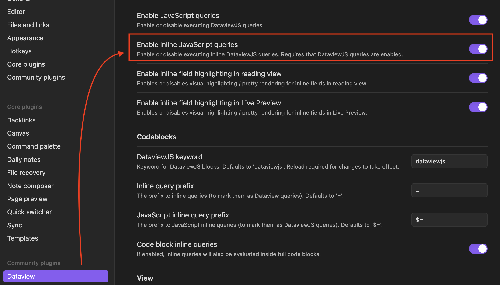

# Troubleshooting

## Dashboards Not Rendering

If dashboards show raw Dataview code instead of rendered results:

1. Make sure Dataview is installed (Settings → Community plugins)
2. Enable JavaScript Queries:
   - Settings → Dataview
   - Turn on JavaScript Queries
   - Restart Obsidian

Activity capture works without Dataview, but dashboards and the Kanban board require it.

### Setting up DataView

### Plugin Not Appearing

If Creation Ledger doesn't appear in Community Plugins:

1. Check that the plugin folder is named `creation-ledger` (must match manifest.json)
2. Verify the folder is in `.obsidian/plugins/`. This folder is usually hidden by the OS and not usually visible in Obsidian.
3. Restart Obsidian
4. Check Settings → Community plugins → Installed plugins

### Files Not Creating

If notes aren't being created:

1. Check that the root folder setting is valid (Settings → Creation Ledger)
2. Ensure you have write permissions in your vault
3. Check the console (Help → Toggle Developer Tools) for error messages

## When to Use It

Refer to this page when you encounter issues with:
- Dashboards not displaying
- Plugin not loading
- Files not creating
- Settings not saving

## Related

- [Getting Started](getting-started.md)
- [Dashboards](dashboards.md)
- [Settings](settings.md)

